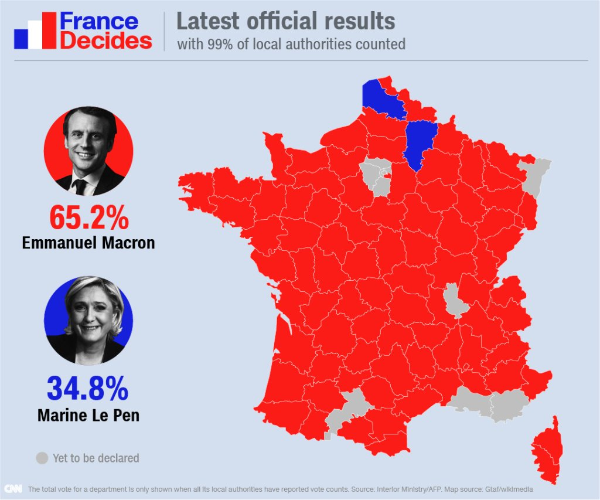
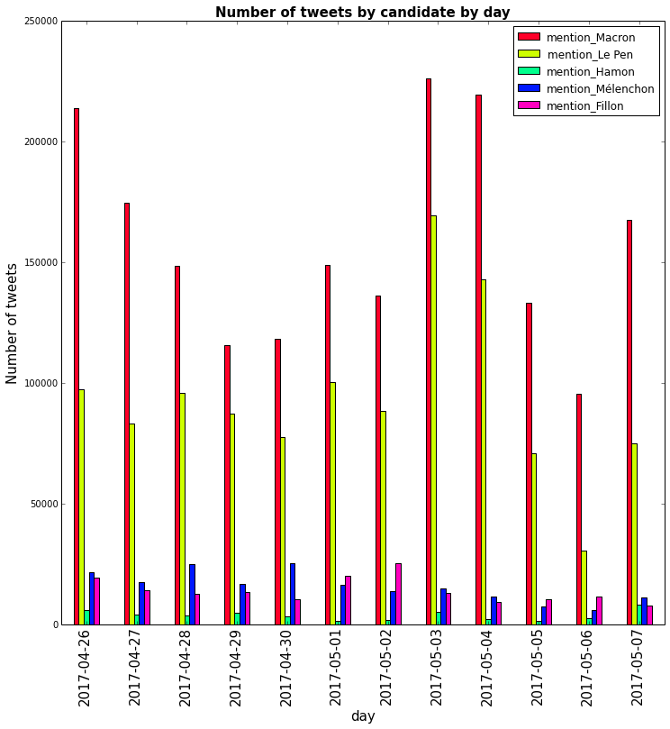

# French Presidential Election Analysis



## Contents
* About
* Background
* Pre-requisites
* Acknowledgements

## About

French Presidential Election 2017 was a rather strange one. A person not known in the world of politics a year ago, managed to win the Elections. This project aims to find out the reasons behind this Shift using analysis of tweets, and periodical plotting of data. 

## Background

### Who are the candidates?

The top five candidates in 2017's French election are: 
* François Fillon (Les Republicains)
* Benoît Hamon (Socialists)
* Marine Le Pen (Front National) 
* Emmanuel Macron (Independent) 
* Jean-Luc Mélenchon (Unbowed France). 

### Why did Macron win? 

* Rising anger among French People due to higher rates of  unemployement,corruption and scandals.
* His support for bein a part of European Union
* His new vision gave people hope. (how BJP in India gave hope to people after Congress's rule)

#### Macron's popularity



### Prerequisites

What things you need to know/install the software and how to install them

```
* Python
* Libraries 
	* numpy
	* pandas
	* matplotlib
```


